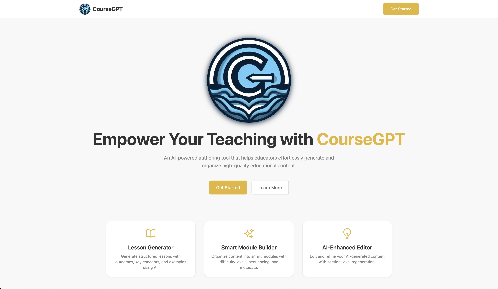
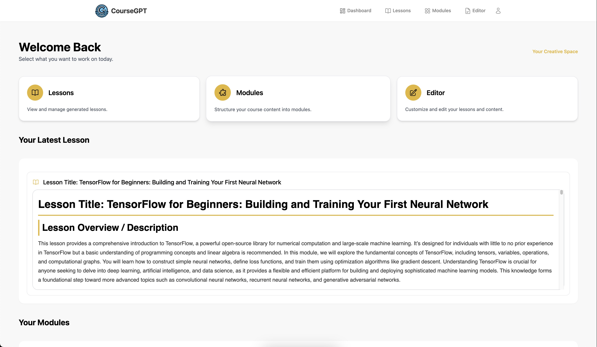
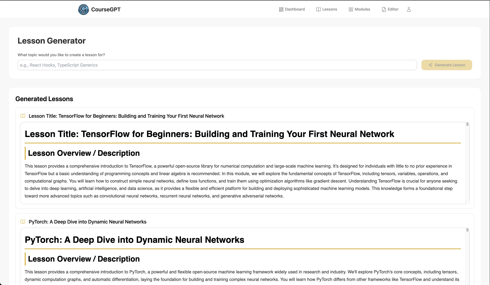
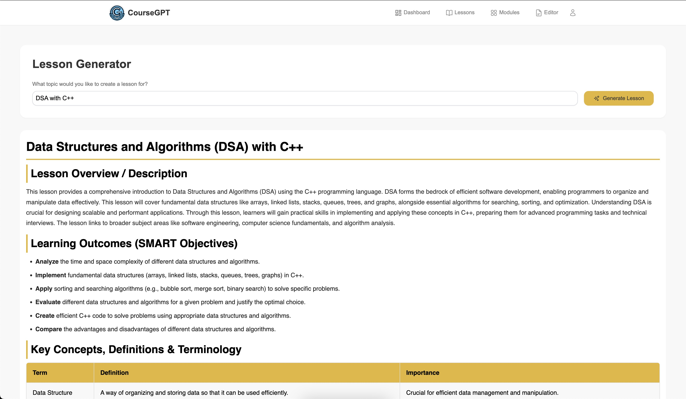
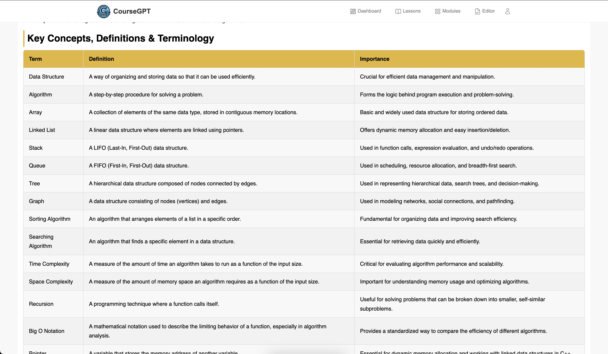
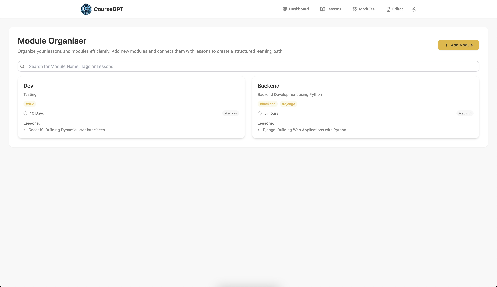
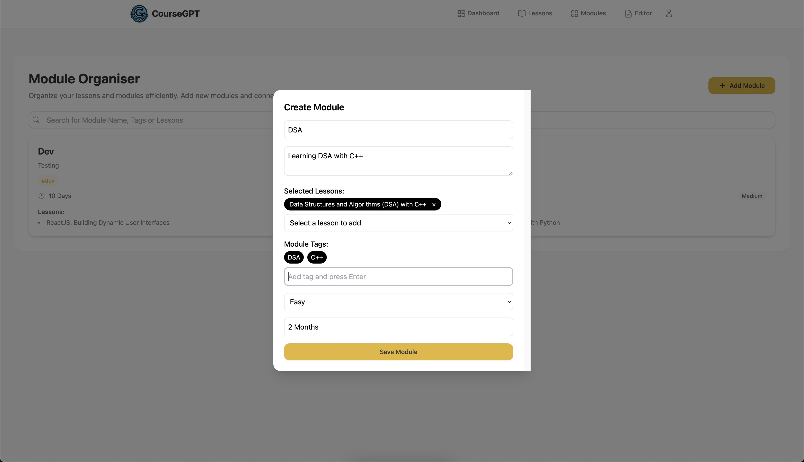
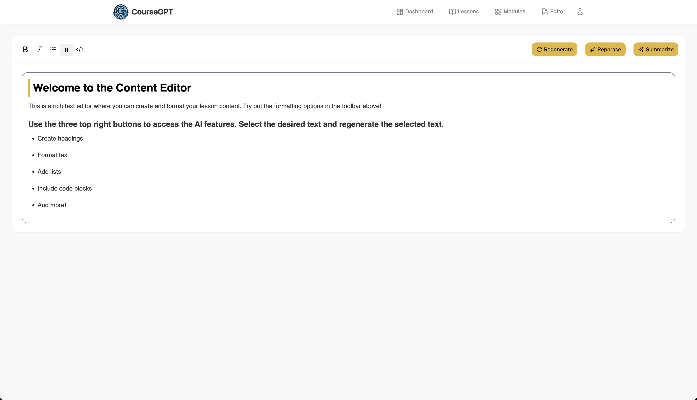
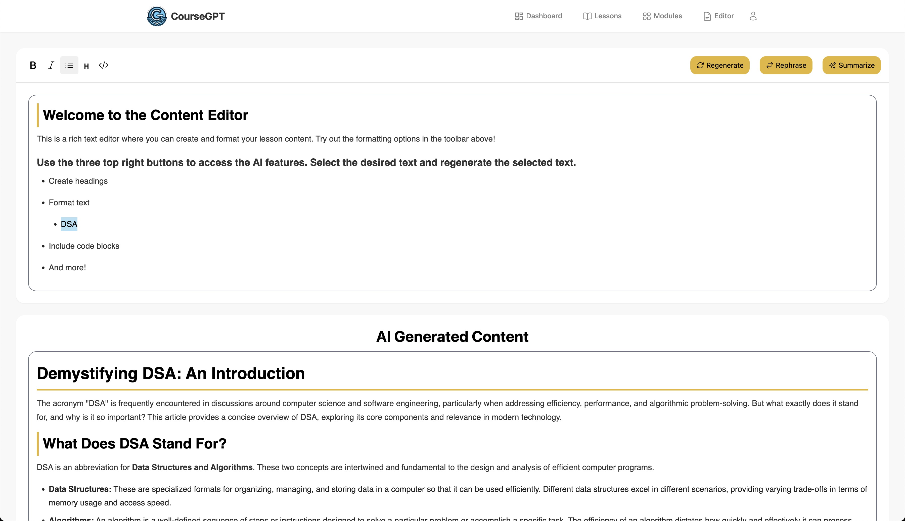

# CourseGPT — Full Stack Project

This is a full-stack web application built with:

- **Frontend**: React (Vite) + Tailwind CSS + Framer Motion + Heroicons
- **Backend**: Node.js + Express + MongoDB (Mongoose)
- **Authentication**: JWT-based with cookies
- **Deployment options**: Firebase Hosting (frontend), Azure (backend)

---

## 📁 Project Structure

```
.
├── frontend/                 # Vite + React frontend
│   ├── src/
│   │   ├── components/
│   │   ├── pages/
│   │   ├── routes/
│   │   └── App.tsx
│   └── index.html
├── backend/                  # Express server
│   ├── routes/
│   ├── models/
│   ├── controllers/
│   ├── .env
│   └── server.js
├── README.md
└── .gitignore
```

---

## 🚀 Frontend (React + Vite)

### 📦 Tech Stack

- Vite
- React with TypeScript
- Tailwind CSS
- Framer Motion
- Heroicons
- js-cookie
- React Router

### 📄 Main Features

- Authenticated dashboard
- Navigation bar with animation
- Modules, Lessons, Editor Pages
- Protected routes using cookies

### 🛠️ Setup Instructions

```bash
cd frontend

# Install dependencies
npm install

# Start local server
npm run dev
```

- The app runs at `http://localhost:5173` (default Vite port)
- Set API base URLs in a `.env` file (if needed):

```env
VITE_BASE_UR=http://localhost:5001
```

---

## 🧠 Backend (Express + MongoDB)

### 📦 Tech Stack

- Node.js
- Express
- Mongoose (MongoDB)
- dotenv
- cors
- JWT Authentication

### 📄 Features

- User authentication (`/api/auth`)
- AI features (`/api/ai`)
- Lesson modules (`/api/module`)
- Editor route (`/api/editor`)
- CORS middleware setup for frontend communication

### 🛠️ Setup Instructions

```bash
cd backend

# Install dependencies
npm install

# Create a `.env` file
touch .env
```

#### Example `.env`:

```env
PORT=5001
MONGO_URI=mongodb+srv://<username>:<password>@cluster.mongodb.net/coursegpt
JWT_SECRET=your_jwt_secret_key
```

### Run the backend:

```bash
node server.js
```

- API will run at `http://localhost:5001`

---

## 🔄 Connecting Frontend and Backend

Make sure the frontend is pointing to the correct API URL.

In your `frontend/.env`:

```env
VITE_API_URL=http://localhost:5001/api
```

In your frontend service files:

```ts
axios.get(`${import.meta.env.VITE_API_URL}/auth/login`);
```

---

## 🔒 Auth Handling

- Auth token stored in browser cookies using `js-cookie`
- On protected routes, a check is performed in `useEffect`
- If token is missing or invalid, user is redirected to `/login`

---

## 📦 Build for Production

### Frontend

```bash
cd frontend
npm run build
```

### Backend

- Bundle your server and host it on Render / Azure / Railway, etc.
- Ensure CORS and environment configs are correctly set

---

## 🧪 Example Routes

### Frontend

- `/` — Landing Page
- `/login` — Login Page
- `/dashboard` — Protected Dashboard
- `/modules`, `/editor`, `/lessons`

### Backend

- `GET /api/auth/user`
- `POST /api/auth/login`
- `POST /api/module`
- `GET /api/ai/generate`

---

## ☁️ Deployment Notes

### Firebase Hosting (Frontend)

```bash
npm install -g firebase-tools

cd frontend
npm run build
firebase login
firebase init hosting
firebase deploy
```

### Azure App Service (Backend)

```bash
az login
az webapp up --name your-app-name --resource-group your-rg-name --runtime "NODE|22-lts"
```

---

## 🧹 Troubleshooting

- Check `.env` values
- MongoDB connection error? Use correct connection string
- CORS issues? Ensure `cors()` and `Access-Control-Allow-*` headers are set

---

## 👥 Contributors

- Taranjeet Singh Bedi (Full Stack Developer, UI/UX Designer)

## 🖥️ Screenshots











## 🎥 Watch the Demo

[](https://youtu.be/j3sZ3LEv-tU)

<p style="text-align:center">Click on the image to watch the demo video</p>
